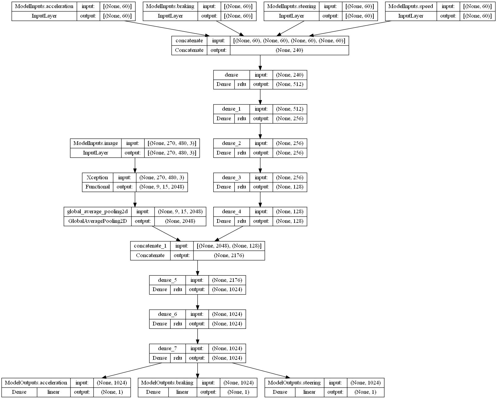
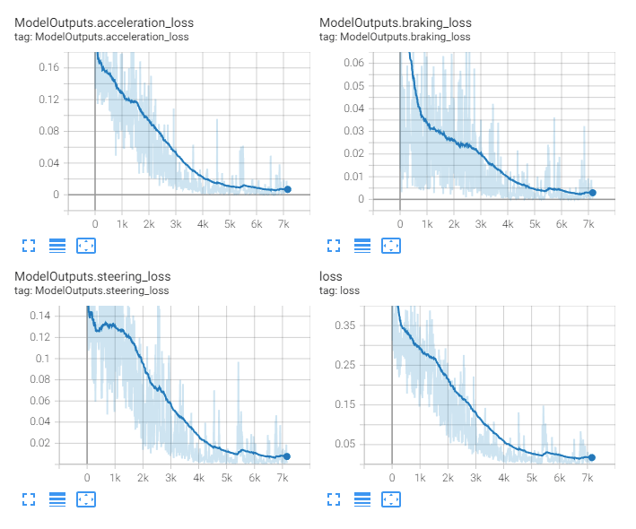
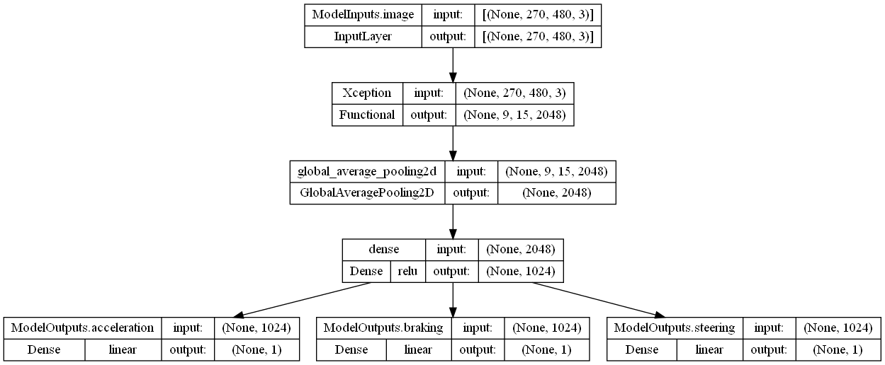
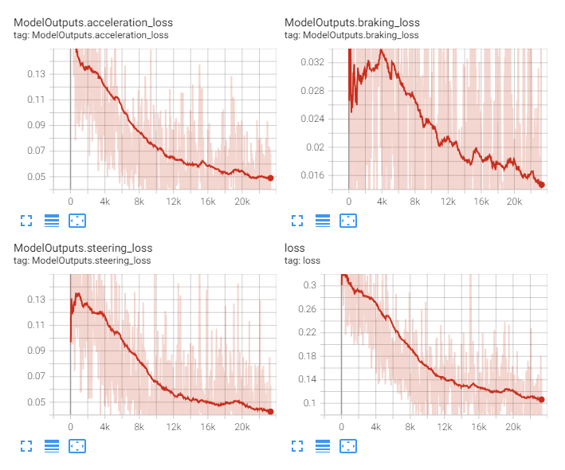
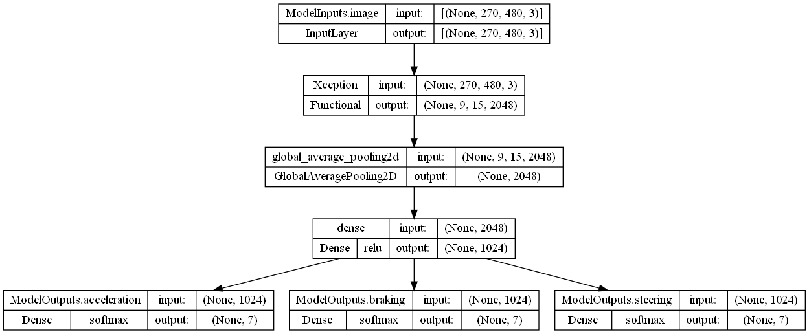
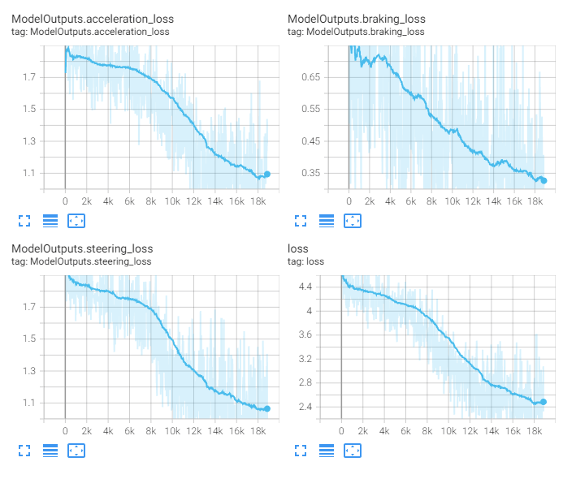
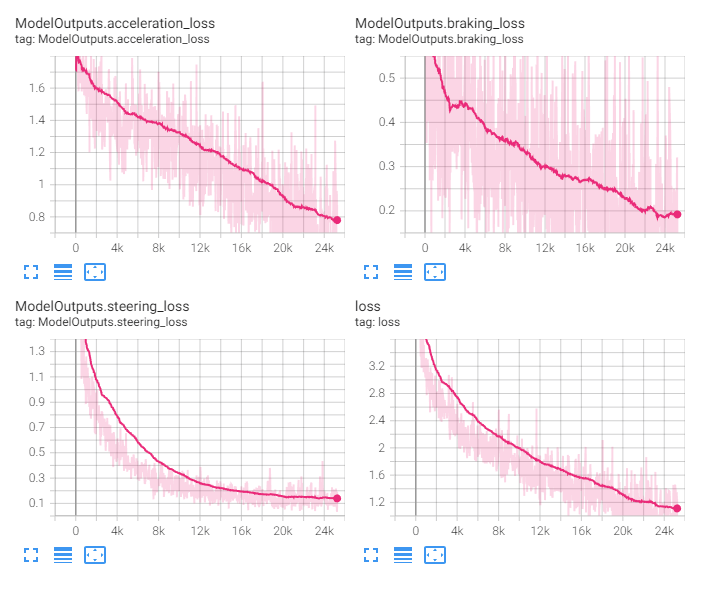
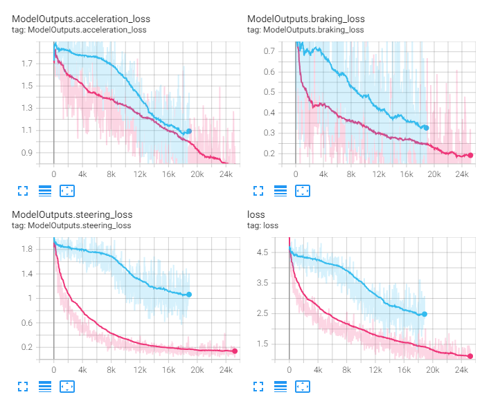
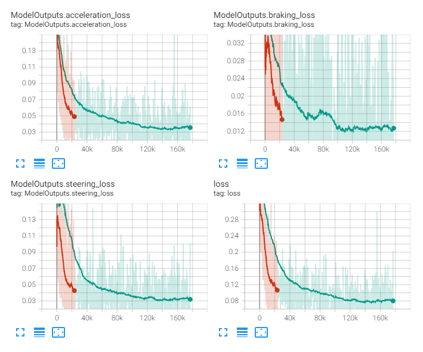

<< [Back](../../../)

# model_0001_xception

This model line consists of different model architectures using [`Xception`](../project_info/xception.md) as the CNN backbone and [`Balancing_v1`](../project_info/data_balancing.md) for data balancing. These are the first performed tests of the system as a whole. With these models, we are checking regression and discrete delta outputs.

## List of the models:
- [`model_0001_xception_v1`](#model_0001_xception_v1)
- [`model_0001_xception_v2`](#model_0001_xception_v2)
- [`model_0001_xception_v3`](#model_0001_xception_v3)
- [`model_0001_xception_v4`](#model_0001_xception_v4)
- [`model_0001_xception_v5`](#model_0001_xception_v5)
- [`model_0001_xception_v6`](#model_0001_xception_v6)

 
 

## model_0001_xception_v1

Training periods: `April 8th` (batches: *0-10800*, off-stream)  
Training batches (total): *10800*

*Model summary:*  
- Total params: `25,562,923`
- Trainable params: `25,508,395`
- Non-trainable params: `54,528`

*Model architecture:*  

*Tensorboard logs:*  

This is the first tracked model. It consists of 3 regression outputs (for acceleration, braking, and steering) and 2 types of inputs:
- convolutional - using [`Xception`](../project_info/xception.md) as the CNN backbone with an input of a single frame image at the resolution of `480x270`
- densely connected - concatenates last 60 acceleration, braking, and steering actions as well as last 60 speed readings

Concatenated numerical data are being fed through the 5 densely connected layers and then concatenated to the CNN output vector and fed through additional 3 densely connected layers before the output layers are attached.

This was a test run without using `data buffers` to see if the model trains. `Data buffers` ensure there are enough samples collected for the random sample draws forming batches to consist of different data. What this means is we do not want to train a model using just the current (newest) data as it’ll consist of similar images and quite similar sequences of actions. Instead, we want to draw batches in such a way they consist of samples from different map areas collected at different timestamps for the data to be a good generalization of the whole dataset. Tests did show the buffer has a very positive effect on the model generalization and loss (otherwise model is being trained on the area NPCs are currently at which is not a good representation of the whole possible samples and causes local overfitting that’s constantly changing with data).

 
 

## model_0001_xception_v2

Training periods: `April 8th-9th` (batches: *0-7150*, off-stream)  
Training batches (total): *7150*

*Model summary:*  
- Total params: `25,562,923`
- Trainable params: `25,508,395`
- Non-trainable params: `54,528`

*Model architecture:*  

*Tensorboard logs:*  

This model is identical to the [`model_0001_xception_v1`](#model_0001_xception_v1). It consists of 3 regression outputs (for acceleration, braking, and steering) and 2 types of inputs:
- convolutional - using [`Xception`](../project_info/xception.md) as the CNN backbone with an input of a single frame image at the resolution of `480x270`
- densely connected - concatenates last 60 acceleration, braking, and steering actions as well as last 60 speed readings

Concatenated numerical data are fed through the 5 densely connected layers, concatenated with the CNN output vector next, and fed through additional 3 densely connected layers before the output layers.

This training session took advantage of the buffer consisting of 25k samples for each of the outputs. `Data buffers` ensure there are enough samples collected for the random sample draws forming batches to consist of different data. What this means is we do not want to train a model using just the current (newest) data as it’ll consist of similar images and quite similar sequences of actions. Instead, we want to draw batches in such a way they consist of samples from different map areas collected at different timestamps for the data to be a good generalization of the whole dataset. Tests did show the buffer has a very positive effect on the model generalization and loss (otherwise model is being trained on the area NPCs are currently at which is not a good representation of the whole possible samples and causes local overfitting that’s constantly changing with data). 

A comparison of the model trained using buffers (this model, blue line) and not using buffers (orange line, [`model_0001_xception_v1`](#model_0001_xception_v1)]):  

This model probably should be trained for much longer, since (as we realized later) it might take multiple times more steps for the model to start converging. The loss, however, fell to pretty low values but also the car (during inference) did not want to steer at all. We later figured out the reason for this is model did fit the numerical data inputs only (or rather mostly) as this guaranteed achieving the lowest loss quickly. Later we also found a bug - we are using past steering data (data history) as additional inputs to the model to give it some sort of “knowledge” of past actions taken, but it turned out that during the training, we've been using the current steering values (which are the outputs of the model, or the model’s prediction) also as the first value in the input history data sequence. This is an obvious mistake and the history data should be truly historical only. The model most likely figured this out and has been predicting this same (or similar) value. During the inference, however, the first value in the steering history has been truly the last historical one (since we are about to make a current prediction) and the model has, most likely, been replicating what it has learned during training - to predict the first historical value, which is the previous prediction. This is why the model has been sticking to the last performed action so much. What confirms this fact is that when we applied some steering “by hand” (using a keyboard as the input to the game), the model has been keeping this action (since it read it as the last one).

 
 

## model_0001_xception_v3

Training periods: `April 9th-10th` (batches: *0-23300*, off-stream)  
Training batches (total): *23300*

*Model summary:*  
- Total params: `22,962,731`
- Trainable params: `22,908,203`
- Non-trainable params: `54,528`

*Model architecture:*  

*Tensorboard logs:*  

This model consists only of the [`Xception`](../project_info/xception.md) model as the CNN backbone, a single densely connected layer, and the output layers for each of the outputs.

With this model, we wanted to test how much different the training is going to be while training only the CNN backbone without these additional inputs (acceleration, braking, steering, and speed history). The approach chosen here is to use not more than necessary densely-connected layers (in some occasions densely-connected layers can lower the performance of the CNN).

This model is the first model which shows signs of driving - it can accelerate and drive forward, decelerate and brake in front of obstacles, and is trying to steer to stay on the road. However, the amount of steering this model is applying is rather small, not enough to make the desired effect (we later realized this is because of the data balancing method - [`Balancing_v1`](../project_info/data_balancing.md) and fixed that with the [`model_0002_xception`](../model_0002_xception) model using [`Balancing_v2`](../project_info/data_balancing.md)).

 
 

## model_0001_xception_v4

Training periods: `April 9th` (batches: *0-18850*, off-stream)  
Training batches (total): *18850*

*Model summary:*  
- Total params: `22,981,181`
- Trainable params: `22,926,653`
- Non-trainable params: `54,528`

*Model architecture:*  

*Tensorboard logs:*  

This is an attempt of training a discrete delta model - a classification type of model predicting by how much to change the output value.

This model consists only of the [`Xception`](../project_info/xception.md) model as the CNN backbone, a single densely connected layer, and the output layers for each of the outputs (but they're classification outputs this time as opposed to regression used in the other models).

A discrete-delta model predicts, using classification, how much of a steering value to add to a given input. The bins (possible predicted actions) were `[-0.3, -0.1, -0.03, 0, 0.03, 0.1, 0.3]` for each of the 3 outputs. This model did not learn well and we figured the reason for this is the model does not “know” the current steering values so it does not "know" which changes to said values to predict. For example, near the intersection, when a turn is about to be made, and if the car is moving quickly, the predictions should lower acceleration and raise braking to slow down the car. However, if the car is stopped, the predictions should raise acceleration and lower braking if it's applied). High loss values reflect the model's confusion about that.

 
 

## model_0001_xception_v5

Training periods: `April 9th-10th` (batches: *0-25200*, off-stream)  
Training batches (total): *25200*

*Model summary:*  
- Total params: `23,044,669`
- Trainable params: `22,990,141`
- Non-trainable params: `54,528`

*Model architecture:*  

*Tensorboard logs:*  

This is also a discrete delta model and it has been created by modifying the [`model_0001_xception_v4`](#model_0001_xception_v4) model. It consists of the [`Xception`](../project_info/xception.md) model as the CNN backbone and additional inputs of the currently applied steering values to the car. These inputs are concatenated together and then concatenated to the CNN backbone output.

As described in the [`model_0001_xception_v4`](#model_0001_xception_v4) model, the lack of knowledge of the previously applied car steering values made it impossible for the model to learn discrete delta values. With this model, we added these missing steering values as inputs so the model can try to use them as a reference. In theory, they should let the model figure out which steering change to apply as it will 'know" current values. This model, however, did not learn any good driving skills and its predicted actions are far from being what we could call decent or at least good enough. After all the future improvements we might give it another try and train it for more epochs.

This is how the loss between the two discrete delta models compare - [`model_0001_xception_v4`](#model_0001_xception_v4) (blue line, lack of knowledge of the current steering values) and [`model_0001_xception_v5`](#model_0001_xception_v5) (the current model, pink line, the current applied steering values added as additional inputs):

 
 

## model_0001_xception_v6

Training periods: `April 10th-15th` (batches: *0-176850*, off-stream)  
Training batches (total): *176850*

*Model summary:*  
- Total params: `23,799,371`
- Trainable params: `23,744,843`
- Non-trainable params: `54,528`

*Model architecture:*  

*Tensorboard logs:*  

This model is similar to the [`model_0001_xception_v3`](#model_0001_xception_v3) model - it consists only of the [`Xception`](../project_info/xception.md) model as the CNN backbone, a single densely connected layer, but the difference is it now contains more capacity in the output heads - 3 additional densely-connected layers (with the number of neurons in each of the consecutive layers being divided by 4), then the output layers for each of the outputs are identical to the [`model_0001_xception_v3`](model_0001_xception_v3) - each is a regression output containing a single neuron.

First, when we compare the results of this and mentioned [`model_0001_xception_v3`](model_0001_xception_v3) model:  
  
we can notice that we probably did not give the [`model_0001_xception_v3`](model_0001_xception_v3) model enough time to train and we cut it off too early. At this point, we did not know yet how long it can take for these models to converge. We cannot be sure, but if we judge by the shape of the loss, it is possible that [`model_0001_xception_v3`](model_0001_xception_v3) would not perform better than the current model anyway.

The below video shows how this model has been driving at April 13th with about 120,000 batches trained. Keep in mind this recording has been taken before we started streaming and many things were not yet finished, for example, there's no streaming layout and a lot of stuttering can be seen (click to watch the video):
  

The model does not perform particularly well, the amount of applied steering is fairly low still, but the model can accelerate and then slow down while in front of some obstacles. Even if this is our best model so far, we knew something was not right. Upon more testing and writing additional test code, we realized the issue is data balancing - we've been using balancing which we later called [`Balancing_v1`](../project_info/data_balancing.md) and this is when the [`Balancing_v2`](../project_info/data_balancing.md) was born (read more about it on the [`Balancing`](../project_info/data_balancing.md) page). Basically, the training data consisted mostly of samples with no steering applied, either full or no acceleration applied, and mostly no braking. [`Balancing_v2`](../project_info/data_balancing.md) fixed that by implementing a proper data balancer but yielded additional challenges - one of them was a custom model, [`model_0002_xception`](../model_0002_xception), that has been created to work with the new balancer.
